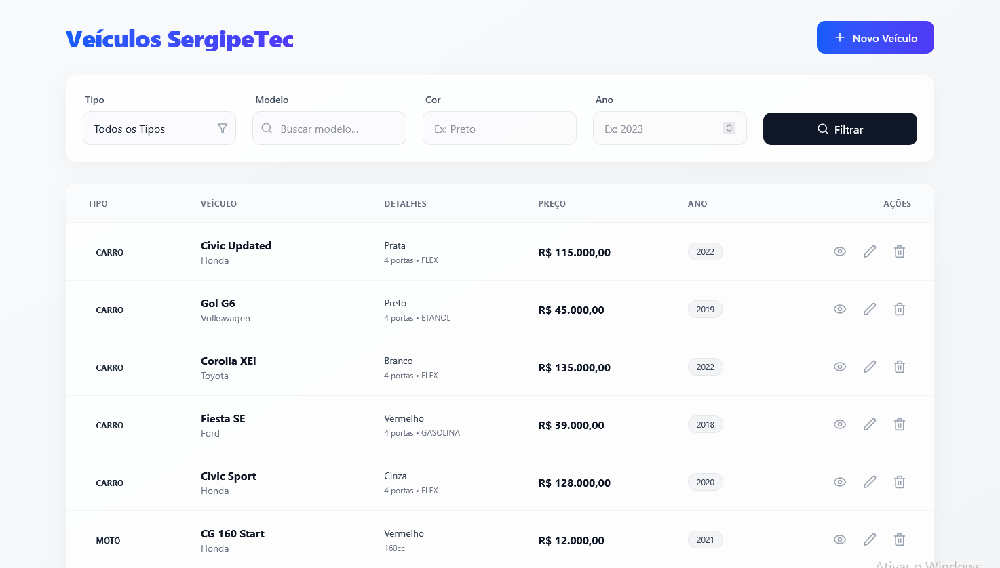

# Desafio_Tecnico_Programador

Este é projeto de gerenciamento de veículos para o desafio do SergipeTec. 
 
O projeto foi desenvolvido utilizando Java, Javalin, React, Vite e Tailwind CSS e MySQL

 

## 📋 Pré-requisitos

Antes de começar, certifique-se de ter instalado em sua máquina:

*   **Node.js**: Versão 18 ou superior.
    *   [Download Node.js](https://nodejs.org/)
*   **npm** (geralmente vem com o Node.js) ou **yarn**.

E também ter em sua maquina  JDK(Java Development Kit),\
que pode ser encontrado em:
[Download JDK](https://www.oracle.com/br/java/technologies/downloads/)

## 🚀 Como Rodar o Projeto

Siga os passos abaixo para configurar e executar o projeto localmente.

### 1. Clonar ou Baixar o Projeto

Se você ainda não tem o projeto em sua máquina, clone o repositório ou extraia os arquivos na pasta desejada.

```bash 
git clone https://github.com/joannestephany/Desafio_Tecnico_Programador
cd Desafio_Tecnico_Programador
```
## BANCO DE DADOS

## 1. Replique o banco localmente em sua maquina

Os arquivos de estrutura do banco e seed para preencher o mesmo podem ser encontrados em
```bash
cd banco
```
Com instruções para reprodução no README.md da pasta.

### Configuração de Conexão

Por padrão, a aplicação tenta conectar com as seguintes credenciais:
*   **URL**: `jdbc:mysql://localhost:3306/bancodesafio`
*   **Usuário**: `root`  
*   **Senha**: `admin` 

Se o seu banco de dados estiver configurado diferente, você pode definir as seguintes variáveis de ambiente antes de rodar a aplicação:

*   `DB_URL`: URL de conexão JDBC (ex: `jdbc:mysql://localhost:3306/meubanco`)
*   `DB_USER`: Usuário do banco
*   `DB_PASSWORD`: Senha do banco
---
## BACKEND

### 1. Entrar na pasta do backend
```bash
cd backend
```
Nesse é pré requisito  
```
Java JDK 17+
```

### 2. Rodar o backend

Execute o comando:

```bash
mvn clean compile exec:java -Dexec.mainClass="com.desafio.Main"
```

O Maven baixa tudo automaticamente ao compilar.

### 3. Conferir se o servidor iniciou

O terminal deve mostrar algo como:

```
Server started on port 7001
```

Sendop possível acessar pela rota:  http://localhost:7001


### Rotas / Endpoints

- GET /veiculos
- GET //veiculos/{id}
- POST /veiculos
- PUT /veiculos/{id}
- DELETE /veiculos/{id}

---
## FRONTEND

### 1. Abrir a pasta frontend em IDE ou Editor de texto (VSCode)
Considerando que o projeto ja foi clonado, abra somente a pasta de frontend para executar as seguintes ações.

Nesse passo é sugerido como pré requisito as versões mais recentes do node
```
npm 11.6.2
node v24.11.1
```
### 2. Instalar Dependências

Abra o terminal na pasta raiz do projeto (onde está o arquivo `package.json`) e execute o comando para instalar as bibliotecas necessárias:

```bash
npm install
# ou, se preferir usar yarn:
yarn
```

### 3. Configurar Variáveis de Ambiente (Opcional)

O projeto espera que o backend esteja rodando. Por padrão, ele pode estar configurado para acessar `http://localhost:8080` (ou a porta definida no seu backend). Verifique o arquivo de serviço (`src/services/api.js` ou similar) se precisar ajustar a URL base da API.

### 4. Rodar o Servidor de Desenvolvimento

Para iniciar o projeto em modo de desenvolvimento, execute:

```bash
npm run dev
# ou
yarn dev
```

Após executar o comando, o terminal mostrará o link de acesso, geralmente:
`http://localhost:5173/`

Abra este link no seu navegador para ver a aplicação.

## 🛠️ Scripts Disponíveis

No arquivo `package.json`, você encontrará os seguintes scripts:

*   `npm run dev`: Inicia o servidor de desenvolvimento.
*   `npm run build`: Compila o projeto para produção (gera a pasta `dist`).
*   `npm run preview`: Visualiza a versão de produção localmente após o build.


## 🎨 Tecnologias Utilizadas
*   [MySQL](https://www.mysql.com)
*   [Java](https://www.java.com/pt-BR/)
*   [Javalin](https://javalin.io)
*   [React](https://react.dev/)
*   [Vite](https://vitejs.dev/)
*   [Tailwind CSS](https://tailwindcss.com/)
*   [Axios](https://axios-http.com/)

